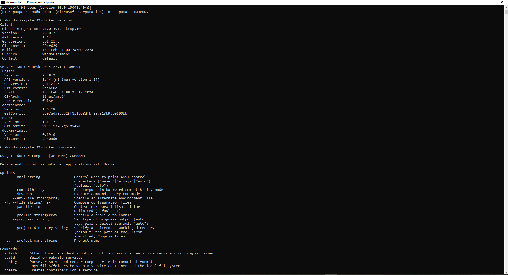

**Вводный курс по Big Data (семинары).**  
Коошелев.А.  
**Урок 1. Введение в Большие Данные.** 
Домашняя работа.  
1) Ознакомьтесь / изучите библиотеки:  
📌 https://joblib.readthedocs.io/  
📌 https://www.dask.org/  
📌 https://www.ray.io/  
2) Установите Docker (https://docs.docker.com/desktop/)  
3) Посчитать средний балл фильмов. Подробнее в нотебуке: 
 https://drive.google.com/file/d/1hPp3m1wPBKSyhqrO9zJidiW9rwsOSV_f/view?usp=share_link.    

