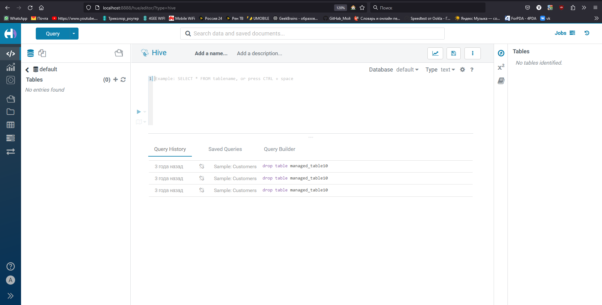

**Вводный курс по Big Data (семинары).**  
Коошелев.А.  
**Урок 2. SQL & Big Data.**  
Домашняя работа.  
1) Поднять кластер локально с помощью контейнеров в Docker (делали на семинаре);  
2) Загрузите датасет по ценам на жилье Airbnb, доступный на kaggle.com:
https://www.kaggle.com/dgomonov/new-york-city-airbnb-open-data;  
3) Используя Python, реализуйте скрипт mapper.py и reducer.py для расчета,  
и с помощью MapReduce расчитайте среднее значение и дисперсию по признаку “price”  
(возможно потребуются ассимптотические формулы для дисперсии);

https://github.com/AndreyK89/Tech_Specialty/tree/master/Big_Data/Sem_2    

  
  
  
  
    

[HW_2_BigData.ipynb](HW_2_BigData.ipynb)  
   
[hadoop_docker_v27_Инструкция.docx](hadoop_docker_v27_%D0%98%D0%BD%D1%81%D1%82%D1%80%D1%83%D0%BA%D1%86%D0%B8%D1%8F.docx)