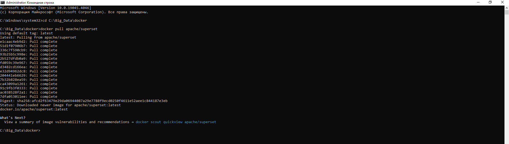
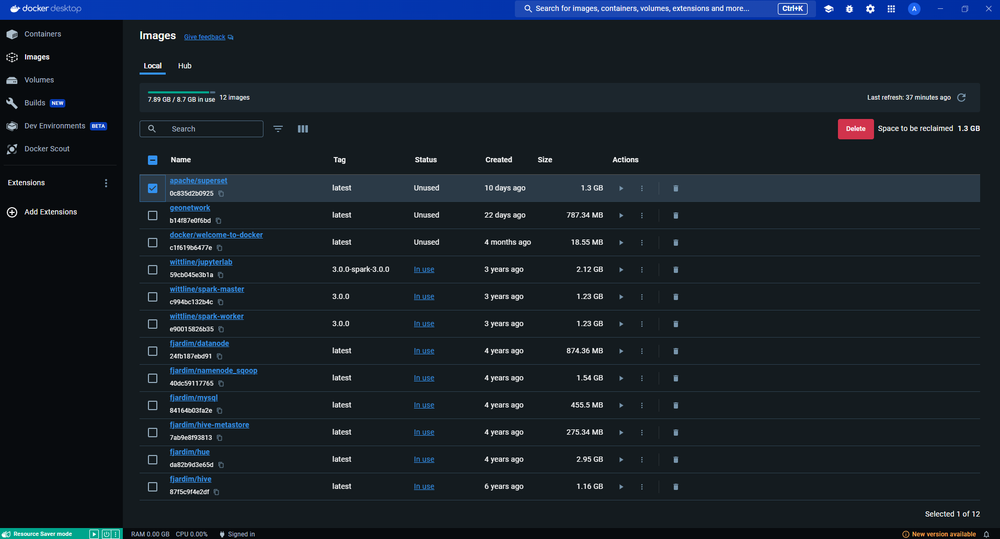
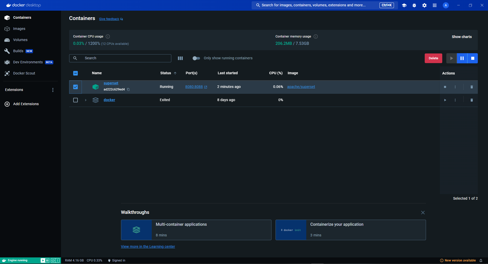
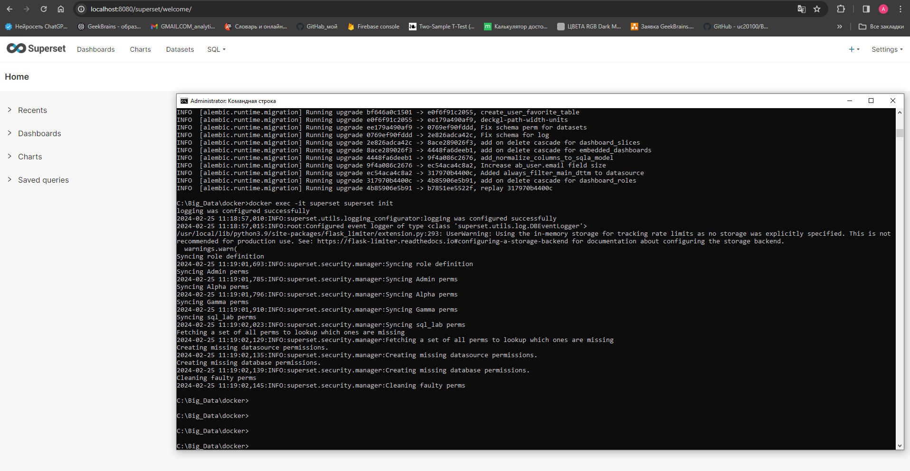
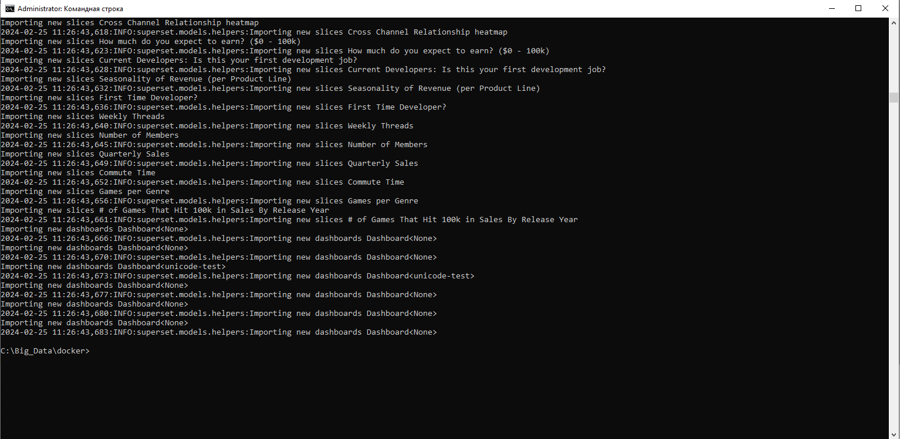
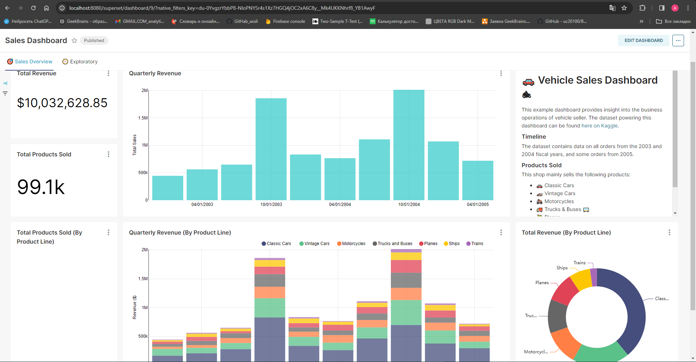
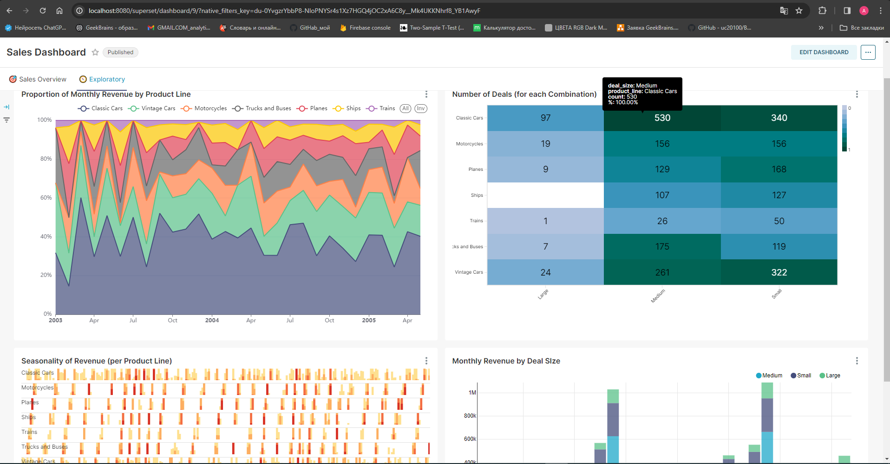

Семинар Введение в Big Data вел Михаил Лебедев.  
Выполнил Кошелев.А  
Домашнее задание:  
1)Установить Superset   
2)Запустить суперсет в виртуальной среде   
Сделать скрины:  
- Командной строки, что все стоит и работает, 2 шт например.  
- Докер, контейнеры присутствуют.  
- Суперсет localhost:8088 запущен.   
Решение:  
1)Установить Superset  
CMD  

  
  
Docker  
  
  
  
Контейнер в Docker  
  
  
  
Поднятие superset в CMD и localhost:8080  
  

  
  
  
Superset Dashboard  
  
  
