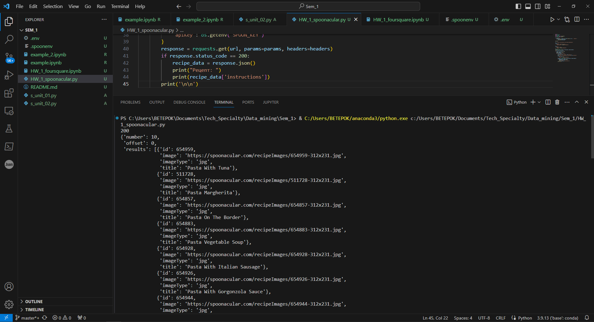
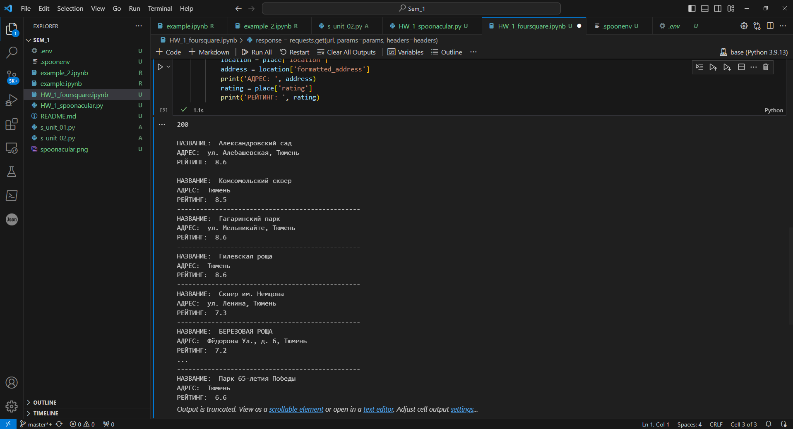

Домашнее задание
1. Ознакомиться с некоторыми интересными API.  
https://docs.ozon.ru/api/seller/  
https://developers.google.com/youtube/v3/getting-started  
https://spoonacular.com/food-api  
  
[HW_1_spoonacular.py](HW_1_spoonacular.py)

2. Потренируйтесь делать запросы к API.
Выберите публичный API, который вас интересует, и потренируйтесь делать API-запросы с помощью Postman. Поэкспериментируйте с различными типами запросов и попробуйте получить различные типы данных.

3. Сценарий Foursquare
- Напишите сценарий на языке Python, который предложит пользователю ввести интересующую его категорию (например, кофейни, музеи, парки и т.д.).
- Используйте API Foursquare для поиска заведений в указанной категории.
- Получите название заведения, его адрес и рейтинг для каждого из них.
- Скрипт должен вывести название и адрес и рейтинг каждого заведения в консоль.    
  
[HW_1_foursquare.ipynb](HW_1_foursquare.ipynb)

