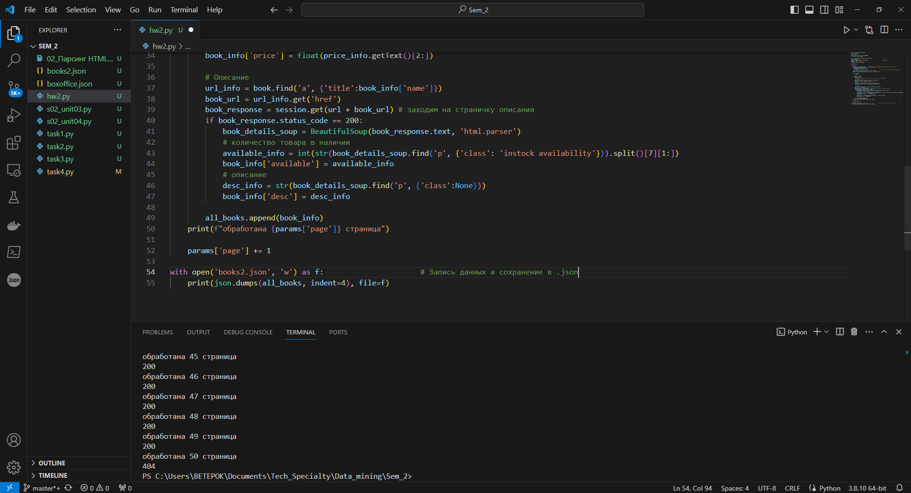
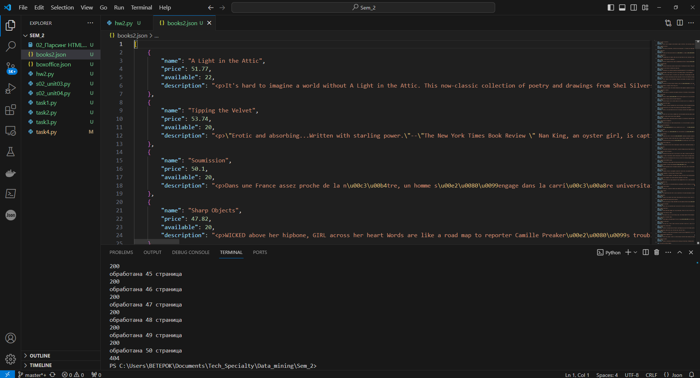

Сбор и разметка данных (семинары).  
Урок 2. Парсинг HTML. BeautifulSoup.  
Домашнее задание:  
Выполнить скрейпинг данных в веб-сайта http://books.toscrape.com/  
и извлечь информацию о всех книгах на сайте во всех категориях: название, цену, количество товара в наличии  
(In stock (19 available)) в формате integer, описание.  
  
Затем сохранить эту информацию в JSON-файле.  
  
Решение.  
[hw2.py](hw2.py)  
  
  
  
  
  
Файл [books2.json](books2.json)