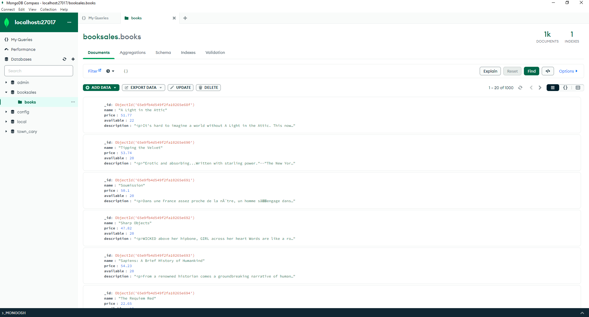
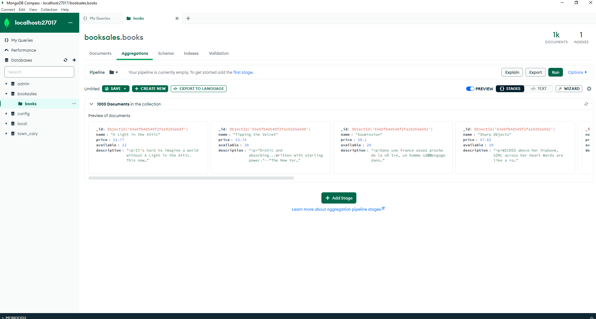
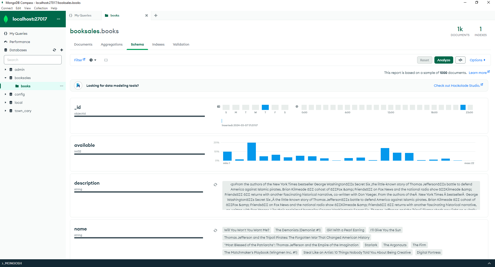

### Сбор и разметка данных (семинары).  
### Урок 3. Системы управления базами данных MongoDB и Кликхаус в Python.  
Установите MongoDB на локальной машине, а также зарегистрируйтесь в онлайн-сервисе.  
https://www.mongodb.com/ https://www.mongodb.com/products/compass  
Загрузите данные который вы получили на предыдущем уроке путем скрейпинга сайта с помощью Buautiful Soup в MongoDB  
и создайте базу данных и коллекции для их хранения.  
Поэкспериментируйте с различными методами запросов.  
Зарегистрируйтесь в ClickHouse.  
Загрузите данные в ClickHouse и создайте таблицу для их хранения.  
  
#### Решение:  
#### Исходный файл books2.json:  
[books2.json](books2.json)  
  
Скрипт кода по ДЗ:  
[HW_3.py](HW_3.py)  
  
#### Запрос "Найти сведения о книге 'Penny Maybe'" выполнен:  
  
  
#### Запрос "Найти книги дороже 59 и дешевле 60" выполнен:  
  
  
#### Запрос "Найти книги, в названии которых есть слово People" выполнен:  
  
  
#### В MongoDB создайте базу данных и коллекции для их хранения:  
  
  
  
  
