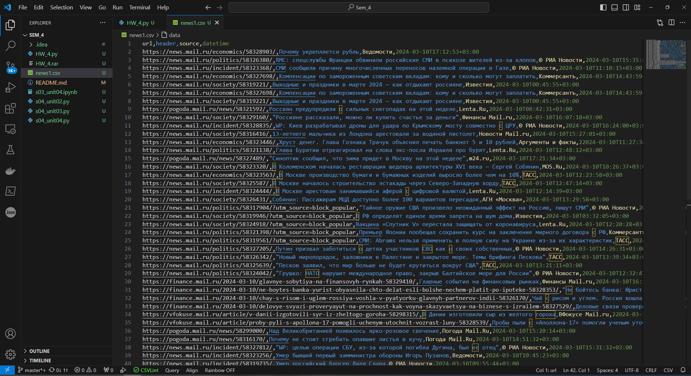

### Сбор и разметка данных (семинары).  
### Урок 4. Парсинг HTML. XPath.  
Выберите веб-сайт с табличными данными, который вас интересует.  
Напишите код Python, использующий библиотеку requests для отправки HTTP GET-запроса на сайт  
и получения HTML-содержимого страницы.  
Выполните парсинг содержимого HTML с помощью библиотеки lxml, чтобы извлечь данные из таблицы.  
Сохраните извлеченные данные в CSV-файл с помощью модуля csv.  
  
Ваш код должен включать следующее:  
Строку агента пользователя в заголовке HTTP-запроса, чтобы имитировать веб-браузер и избежать блокировки сервером.  
Выражения XPath для выбора элементов данных таблицы и извлечения их содержимого.  
Обработка ошибок для случаев, когда данные не имеют ожидаемого формата.  
Комментарии для объяснения цели и логики кода.  
  
Примечание: Пожалуйста, не забывайте соблюдать этические и юридические нормы при веб-скреппинге.  
  
#### Решение:  
[HW_4.py](HW_4.py)  
  
#### CSV-файл:  
[news1.csv](news1.csv)  
  
