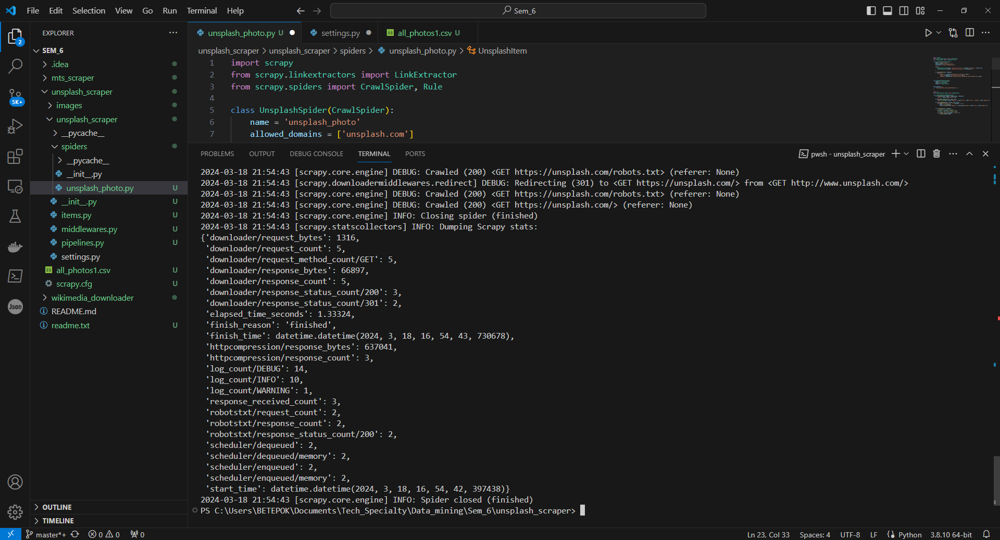
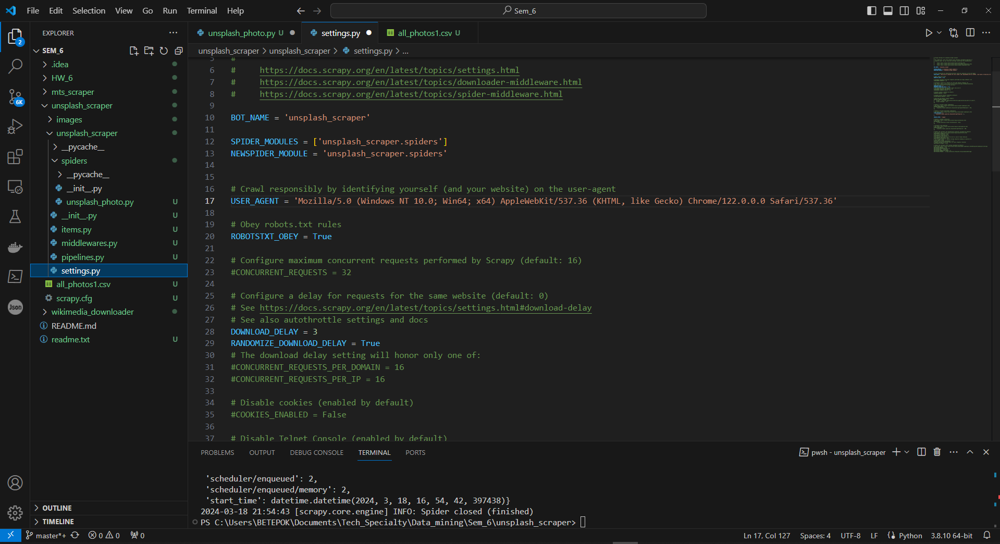
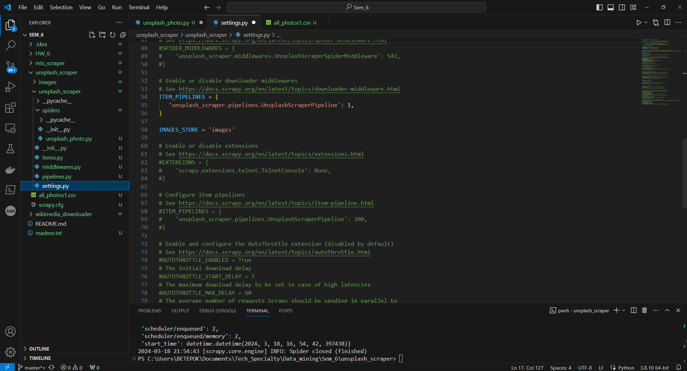
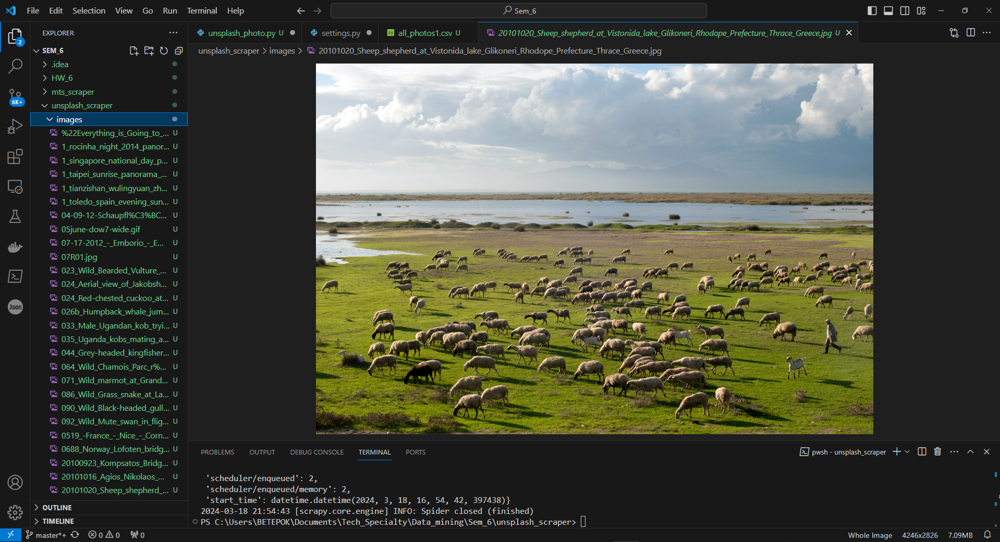

Сбор и разметка данных (семинары).  
Урок 6. Scrapy. Парсинг фото и файлов.  
1. Создайте новый проект Scrapy.  
Дайте ему подходящее имя и убедитесь, что ваше окружение правильно настроено для работы с проектом.  
2. Создайте нового паука, способного перемещаться по сайту www.unsplash.com.  
Ваш паук должен уметь перемещаться по категориям фотографий и получать доступ к страницам отдельных фотографий.  
3. Определите элемент (Item) в Scrapy, который будет представлять изображение.  
Ваш элемент должен включать такие детали, как URL изображения, название изображения и категорию, к которой оно принадлежит.  
4. Используйте Scrapy ImagesPipeline для загрузки изображений.  
Обязательно установите параметр IMAGES_STORE в файле settings.py.  
Убедитесь, что ваш паук правильно выдает элементы изображений, которые может обработать ImagesPipeline.  
5. Сохраните дополнительные сведения об изображениях (название, категория) в CSV-файле.  
Каждая строка должна соответствовать одному изображению и содержать URL изображения,  
локальный путь к файлу (после загрузки), название и категорию.  
  
#### Решение:  
Создан проект Scrapy unsplash_scraper, и паук unsplash_photo  
  
[unsplash_photo.py](unsplash_scraper%2Funsplash_scraper%2Fspiders%2Funsplash_photo.py)
  
  
Изменен файл settings.py  
  
  
  
  
Загружены изображения в папку images   
  
  
 
  
Данные сохранены в файл all_photos1.csv  
