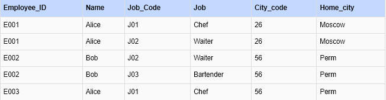

ETL: автоматизация подготовки данных (семинары).
Урок 1. Модели данных и нормализация таблиц. Схема «звезда».
1. Нарисуйте архитектуру ETL процесса для сбора и анализа данных компанией которая хочет провести  
   маркетинговую кампанию, используя app.diagrams.net.  
   Сделайте описание почему вы считаете что архитектура должна выглядеть именно так.
2. Постройте реляционную и иерархическую модели данных для магазина который продает телефоны.
3. Определите в какой нормальной форме данная таблица, приведите её ко 2 и 3 нормальным формам последовательно.
